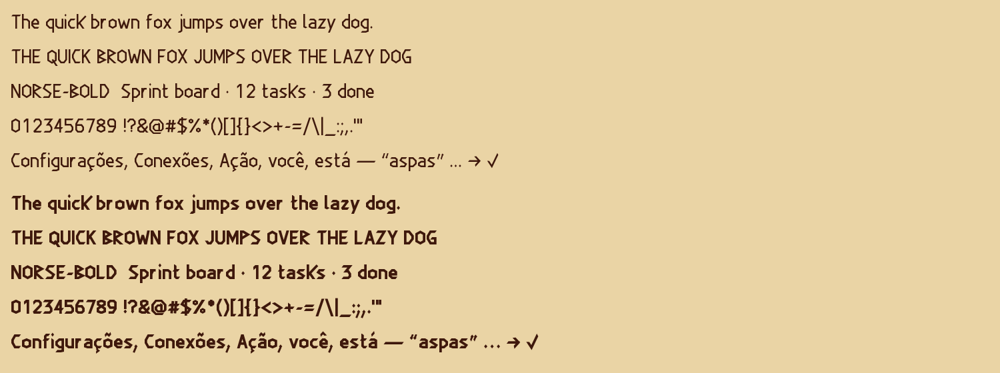

# runic — Studio Runic

The Runic skin's typeface: a carved Latin. Served from `public/fonts/runic/`.

| File | Weight | Used for |
|---|---|---|
| `studio-runic.woff2` | 400 (covers 100–500) | body text, labels |
| `studio-runic-bold.woff2` | 700 (covers 600–900) | `font-semibold` / `font-bold`, headings |

About 6 kB each.

## Where it came from

Drawn for this product, not downloaded. Every glyph is a set of stroke
centrelines in `build-studio-runic.py`, turned into outlines and written out as
WOFF2 by that script — run it again after changing a drawing:

    python custom-font/runic/build-studio-runic.py

It writes both files here and to `public/fonts/runic/`, and renders
`preview.png` beside itself so a change can be checked by eye. Needs
`fonttools`, `brotli`, `numpy` and `Pillow`.

## Why the skin has its own face

The Runic skin's stacks named `'Norse'` first — and no file for it was ever
shipped, so every visitor got Bahnschrift, a DIN-style engineering sans, under
the skin's parchment, runes and carved ornaments. The carved display faces
that do exist come with personal-use or unclear web licences, which the rule in
`custom-font/README.md` rules out whatever they look like. So it is drawn here,
like the Pixel face.

## What makes it read as carved

- **Every stroke is straight.** Curves are facets — O is the long, pointed
  hexagon a carver makes of a circle, C and D are cut on six sides.
- **Strokes that meet a guide line are cut flat along it**, the way a blade
  stops a groove at a ruled line. Free ends are cut on a slant (the *chisel*
  end in the script).
- **Three runes lend their shape to the Latin letters that already look like
  them**: ᛒ (berkanan) is the B, ᚱ (raido) is the R, ᚹ (wunjo) is the P.
- **S is a zigzag**, the way it is cut rather than written.
- **Condensed**: the drawings are set 10–14% narrower than drawn, because a
  carved alphabet is tall and narrow.

## What makes it an interface face and not a poster

- A real lowercase, with the skeleton people read by. Only the curves are
  facetted; nothing is swapped for a rune in running text.
- Cap height 0.70 em and x-height 0.51 em — within a hundredth of the
  Bahnschrift it replaces — so no label that fitted before overflows now.
- An `l` with a foot, so it never reads as a capital `I`.
- Figures on one advance, so counts line up in a column without a feature.
- The Latin-1 accents both interface languages use (á à â ã ä å é è ê ë í ì î ï
  ó ò ô õ ö ú ù û ü ç ñ ý ÿ and their capitals), composed from the face's own
  marks, plus the punctuation, quotes, dashes, arrows and check mark the
  interface draws.

## How the outlines are made

There is no polygon-union library in this toolchain, and a glyph shipped as
overlapping contours shows seams and darker joins on some rasterisers. So the
union is computed by painting: each stroke is rasterised at two pixels per font
unit, the painted region is traced back into contours along pixel edges, and
Ramer–Douglas–Peucker collapses every staircase back into the straight edge it
came from. The result is within a fraction of a font unit of the drawing, with
one clean segment per facet. See the module docstring for the rest.

## Licence

Original work, shipped as part of Task Studio under the application's own
terms. No third-party outlines are included.
